之前写过两篇关于CORS跨域的工作总结，`跨域问题解决方案`和`IE浏览器跨域访问失败`，由于纯粹是工作总结，没有讲明为什么要这么做，就删除了。
 
最近又经常被问到一些问题，比如写java服务端的同学的来问：我服务端明明正确返回了，测试环境debug能看到，为什么前端就是拿不到数据？ 然后写前端的同学会问：为什么我明明设置了withCredentials=true，服务端同学还是拿不到cookie？

所以决定重新捋一捋使用CORS解决跨域的问题，前后端要怎么做？为什么这么做？

<!--more-->

## 为什么会有跨域的问题？

为了保证用户信息的安全，所有的浏览器都遵循同源策略，那什么情况下算同源呢？同源策略又是什么呢？

**记住：协议、域名、端口号完全相同时，才是同源**

可以参考 [Web安全 - 浏览器的同源策略](https://developer.mozilla.org/zh-CN/docs/Web/Security/Same-origin_policy)

在同源策略下，会有以下限制：

- 无法获取非同源的Cookie、LocalStorage、SessionStorage等
- 无法获取非同源的dom
- 无法向非同源的服务器发送ajax请求

但是我们又经常会遇到前后端分离，不在同一个域名下，需要ajax请求数据的情况。那我们就要规避这种限制。

可以在网上搜到很多解决跨域的方法，有些方法比较古老了，现在项目中用的比较多的是jsonp和CORS（跨域资源共享），这篇主要讲CORS的原理和具体实践。

## CORS跨域原理

CORS跨域的原理实际上是浏览器与服务器通过一些HTTP协议头来做一些约定和限制。可以查看  [HTTP-访问控制（CORS）](https://developer.mozilla.org/zh-CN/docs/Web/HTTP/Access_control_CORS)

**与跨域相关的协议头**

|请求头|说明|
|:--|:--|
|Origin|表明预检请求或实际请求的源站URI,不管是否跨域ORIGIN字段总是被发送|
|Access-Control-Request-Method|将实际请求所使用的 HTTP 方法告诉服务器|
|Access-Control-Request-Headers|将实际请求所携带的首部字段告诉服务器|

|响应头|说明|
|:--|:--|
|Access-Control-Allow-Origin|指定允许访问该资源的外域 URI，对于携带身份凭证的请求不可使用通配符*|
|Access-Control-Expose-Headers|指定XMLHttpRequest的getResponseHeader可以访问的响应头|
|Access-Control-Max-Age |指定preflight请求的结果能够被缓存多久|
|Access-Control-Allow-Credentials|是否允许浏览器读取response的内容；<br/>当用在preflight预检请求的响应中时，指定实际的请求是否可使用credentials|
|Access-Control-Allow-Methods|指明实际请求所允许使用的 HTTP 方法|
|Access-Control-Allow-Headers|指明实际请求中允许携带的首部字段|


## 实践

这里写了个demo，一步步来分析。

目录如下：

```
.
├── README.md
├── client
│   ├── index.html
│   └── request.js
└── server
    ├── pom.xml
    ├── server-web
    │   ├── pom.xml
    │   ├── server-web.iml
    │   └── src
    │       └── main
    │           ├── java
    │           │   └── com
    │           │       └── example
    │           │           └── cors
    │           │               ├── constant
    │           │               │   └── Constants.java
    │           │               ├── controller
    │           │               │   └── CorsController.java
    │           │               └── filter
    │           │                   └── CrossDomainFilter.java
    │           ├── resources
    │           │   └── config
    │           │       └── applicationContext-core.xml
    │           └── webapp
    │               ├── WEB-INF
    │               │   ├── dispatcher-servlet.xml
    │               │   └── web.xml
    │               └── index.jsp
    └── server.iml
```

- **Client：前端，简单的ajax请求**

在client文件夹下，启动静态服务器，前端页面通过`http://localhost:8000/index.html`访问

```
anywhere -h localhost -p 8000
```

- **Server： java项目，SpringMVC**

在IntelliJ IDEA中本地启动tomcat，设置host: `http://localhost:8080/`，服务端数据通过`http://localhost:8080/server/cors`请求。


这里前端和后端因为**端口号不同**，存在跨域限制，下面通过CORS来解决因为跨域无法通过ajax请求数据的问题。

### 没有允许跨域的情况

这种情况就是前端什么都不做，服务端也什么都不做。

Client: 请求成功后，将数据显示在页面上

```javascript
new Request().send('http://localhost:8080/server/cors',{
	success: function(data){
		document.write(data)
	}
});
```

Server:

```java
@Controller
@RequestMapping("/server")
public class CorsController {
    @RequestMapping(value="/cors", method= RequestMethod.GET)
    @ResponseBody
    public String ajaxCors(HttpServletRequest request) throws Exception{
        return "SUCCESS";
    }
}
```

在浏览器地址栏输入`http://localhost:8080/server/cors`直接请求服务端，可以看到返回结果： ‘SUCCESS’

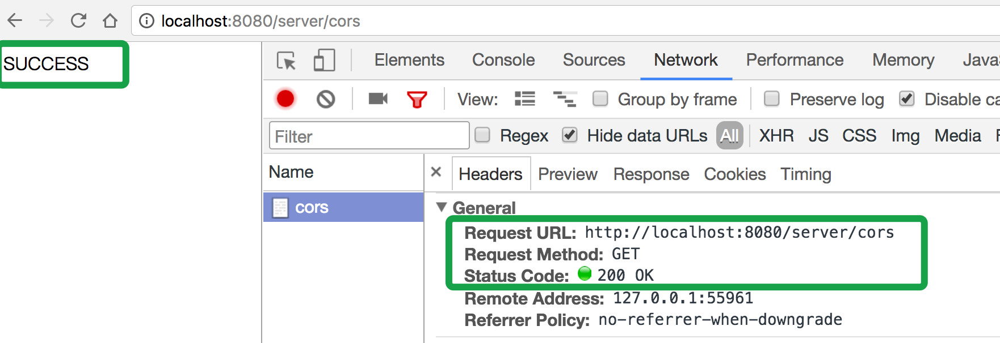

在浏览器地址栏输入`http://localhost:8000/index.html`，从不同域的网页中向Server发送ajax请求。可以看到几个方面：

从network可以看到，请求返回正常。
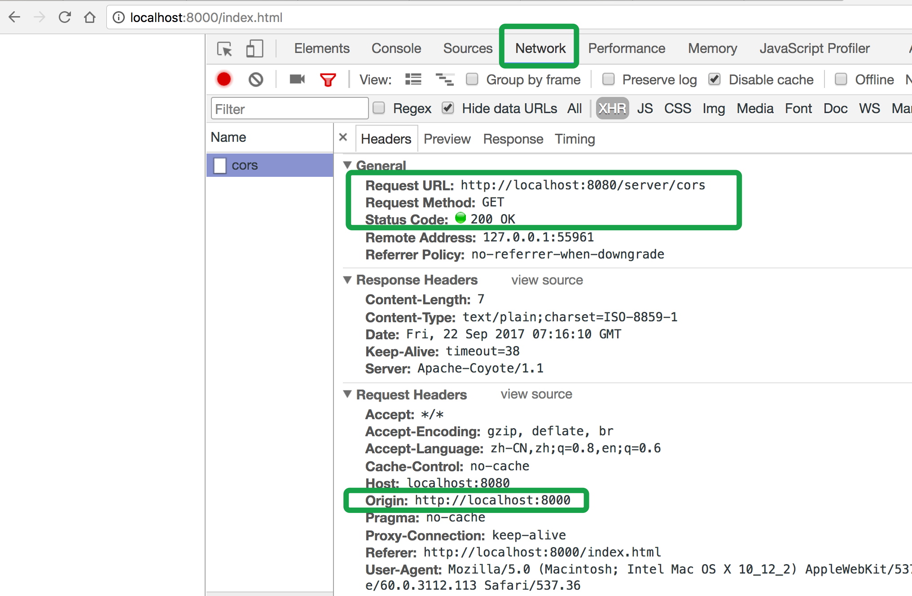

但Response中没有内容，显示 `Failed to load response data`。
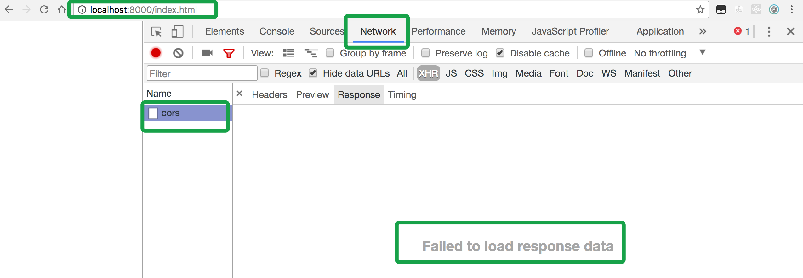

并且控制台报错：
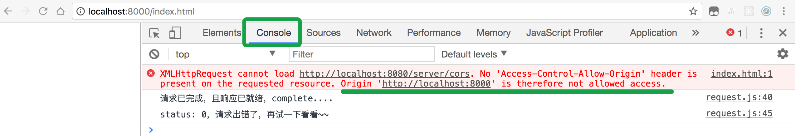

**总结：**

> 1. 浏览器请求是发出去了的，服务端也会正确返回，但是我们拿不到response的内容
> 2. 浏览器控制台会报错提示可以怎么做，而且提示的很明白：	xhr不能请求`http://localhost:8080/server/cors`，请求资源的响应头中没有设置Access-Control-Allow-Origin，Origin：`http://localhost:8000`是不允许跨域请求的。

那下一步，我们要在服务端响应跨域请求时，设置响应头: Access-Control-Allow-Origin

### 设置Access-Control-Allow-Origin允许跨域

先说明为什么要设置Access-Control-Allow-Origin，可以把Access-Control-Allow-Origin当作一个指令，服务端设置Access-Control-Allow-Origin就是告诉浏览器允许向服务端请求资源的域名，浏览器通过Response中的Access-Control-Allow-Origin就可以知道能不能把数据吐出来。

官方解释是这样的： Access-Control-Allow-Origin 响应头指定了该响应的资源是否被允许与给定的origin共享。

Access-Control-Allow-Origin可以设置的值有：

```
Access-Control-Allow-Origin: *
Access-Control-Allow-Origin: <origin>
```

那在java服务端给响应头设置Access-Control-Allow-Origin可以这么做：

1、添加一个过滤器

	```java
	public class CrossDomainFilter implements Filter{
	    public void init(FilterConfig filterConfig) throws ServletException {}
	    public void doFilter(ServletRequest servletRequest, ServletResponse servletResponse, FilterChain filterChain) throws IOException, ServletException {
	        HttpServletResponse resp = (HttpServletResponse)servletResponse;
	        resp.setHeader("Access-Control-Allow-Origin", "http://localhost:8000");
	        filterChain.doFilter(servletRequest,servletResponse);
	    }
	    public void destroy() {}
	}
	```
2、然后在web.xml文件中添加过滤器配置：

	```xml
	<filter>
        <filter-name>crossDomainFilter</filter-name>
        <filter-class>com.example.cors.filter.CrossDomainFilter</filter-class>
    </filter>
    <filter-mapping>
        <filter-name>crossDomainFilter</filter-name>
        <url-pattern>/*</url-pattern>
    </filter-mapping>
	```

3、然后重新启动tomcat，client重新发送请求`http://localhost:8000/index.html`

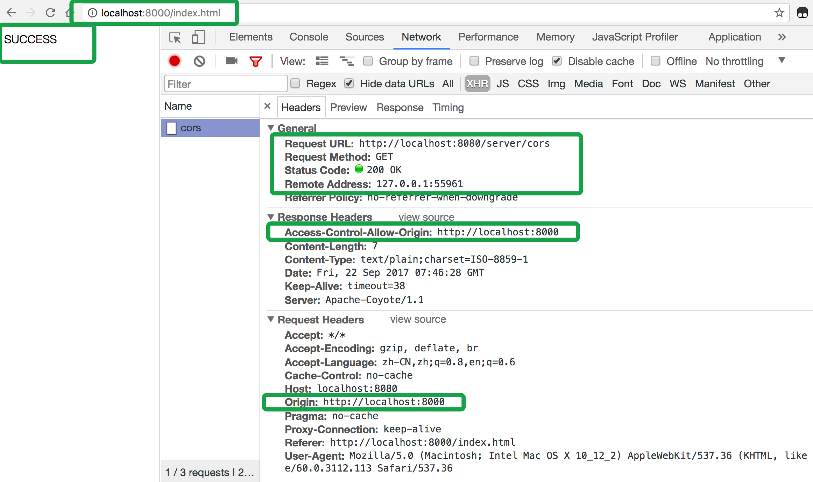
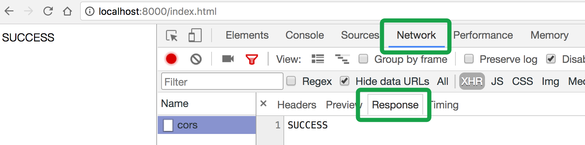

可以看到我们能够拿到返回结果了，响应头中有我们在服务端设置的Access-Control-Allow-Origin: `http://localhost:8000`，这个应该跟请求头中的origin一致，或者设置Access-Control-Allow-Origin:*也是可以的，这就允许任何网站来访问资源了（前提是不带凭证信息，这个后面讲）

**以上就是允许一个简单的跨域请求的做法，只需要服务端设置响应头Access-Control-Allow-Origin。**

### 简单请求与预检请求

上面讲述了一个简单请求通过在服务端设置响应头Access-Control-Allow-Origin就可以完成跨域请求。

那怎样的请求算是一个简单请求？与简单请求相对应的是什么样的请求呢？解决跨域的方式又有什么不一样呢？

符合以下条件的可视为简单请求：

1、使用下列HTTP方法之一
	- GET
	- HEAD
	- POST，并且Content-Type的值在下列之一： 
		- text/plain
		- multipart/form-data
		- application/x-www-form-urlencoded
		
2、并且请求头中只有下面这些
	- Accept
	- Accept-Language
	- Content-Language
	- Content-Type （需要注意额外的限制）
	- DPR
	- Downlink
	- Save-Data
	- Viewport-Width
	- Width

不满足上述要求的在发送正式请求前都要先发送一个预检请求，预检请求以OPTIONS方法发送，浏览器通过请求方法和请求头能够判断是否发送预检请求。

比如Client发送如下请求：

```javascript
new Request().send('http://localhost:8080/server/options',{
	method: 'POST',
	header: {
		'Content-Type': 'application/json'  //告诉服务器实际发送的数据类型
	},
	success: function(data){
		document.write(data)
	}
});
```


Server端处理请求的controller:

```java
@Controller
@RequestMapping("/server")
public class CorsController {
    @RequestMapping(value="/options", method= RequestMethod.POST)
    @ResponseBody
    public String options(HttpServletRequest request) throws Exception{
        return "SUCCESS";
    }
}
```


因为请求时，请求头中塞入了header，'Content-Type': 'application/json'。根据前面讲述的可以知道，浏览器会以OPTIONS方法发出一个预检请求，浏览器会在请求头中加入： 

```
Access-Control-Request-Headers:content-type
Access-Control-Request-Method:POST
```

这个预检请求的作用在这里就是告诉服务器：我会在后面请求的请求头中以POST方法发送数据类型是application/json的请求，询问服务器是否允许。

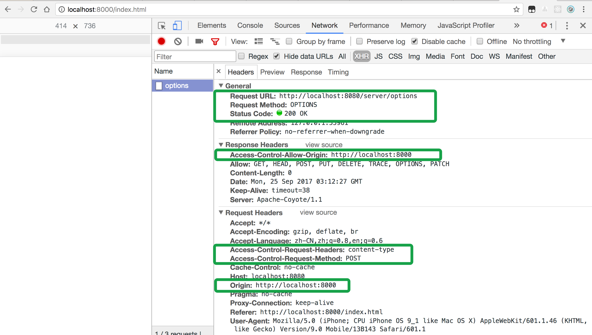

在这里服务器还没有做任何允许这种请求的设置，所以浏览器控制台报错：

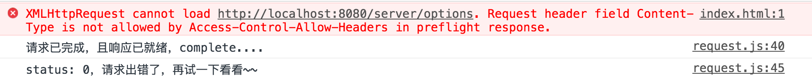

也清楚的说明了出错的原因： **服务端在预检请求的响应中没有告诉浏览器允许协议头Content-Type**，即服务端需要设置响应头Access-Control-Allow-Headers，允许浏览器发送带Content-Type的请求。

Server端过滤器中添加Access-Control-Allow-Headers：

```java
public class CrossDomainFilter implements Filter{
    public void init(FilterConfig filterConfig) throws ServletException {}
    public void doFilter(ServletRequest servletRequest, ServletResponse servletResponse, FilterChain filterChain) throws IOException, ServletException {
        HttpServletResponse resp = (HttpServletResponse)servletResponse;
        resp.setHeader("Access-Control-Allow-Origin", "http://localhost:8000");
        resp.setHeader("Access-Control-Allow-Headers", "Content-Type");
        filterChain.doFilter(servletRequest,servletResponse);
    }
    public void destroy() {}
}
```
可以看到请求成功
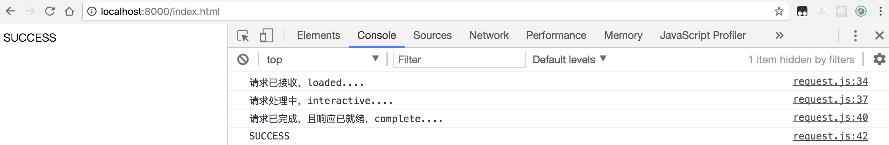

再来看请求的具体信息，第一次以OPTIONS方法发送预检请求，浏览器设置请求头：

```
Access-Control-Request-Headers:content-type //请求中加入的请求头
Access-Control-Request-Method:POST  //跨域请求的方法
```

服务端设置响应头：

```
Access-Control-Allow-Headers:Content-Type   //允许的header
Access-Control-Allow-Origin:http://localhost:8000 //允许跨域的源
```

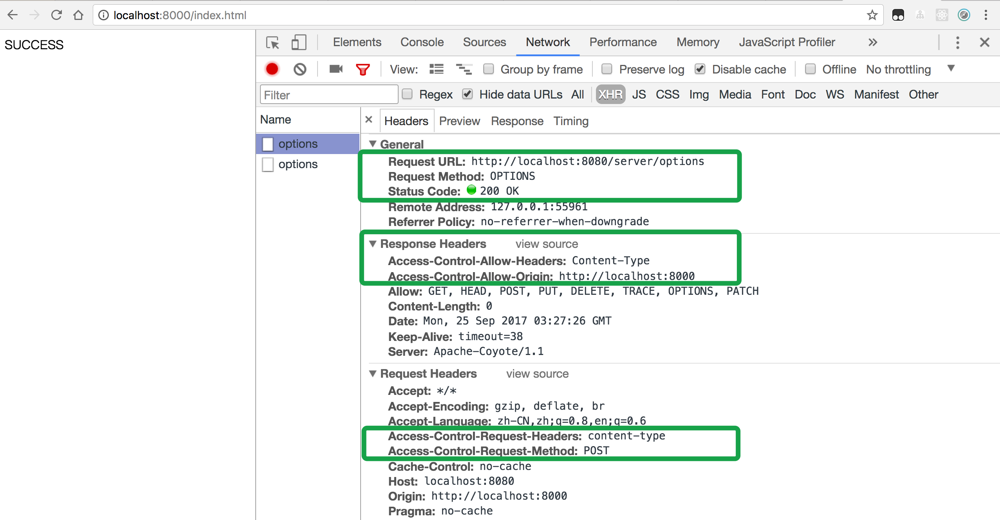
也可以设置Access-Control-Allow-Methods来限制客户端的的请求方法。


这样预检请求成功了，浏览器会发出第二个请求，这是真正请求数据的请求：
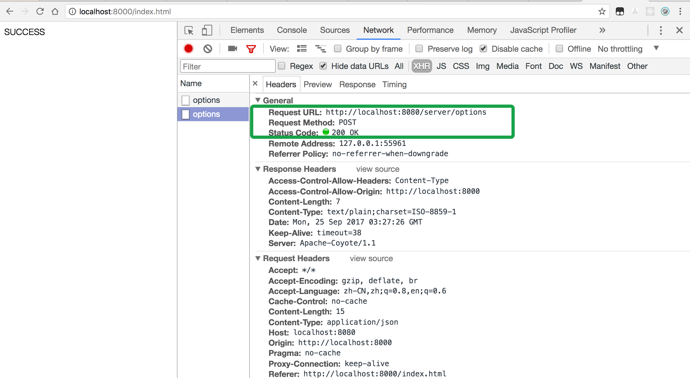

可以看到POST请求成功了，第二次请求头中没有设置Access-Control-Request-Headers和Access-Control-Request-Method。


**但是这里有个问题**，需要预检请求时，浏览器会发出两次请求，一次OPTIONS，一次POST。两次都返回了数据。这样服务端如果逻辑复杂一些，比如去数据库查找数据，从web层、service到数据库这段逻辑就会走两遍，浏览器会两次拿到相同的数据，所以服务端的filter可以改一下，如果是OPTIONS请求，在设置完跨域请求响应头后就不走后面的逻辑直接返回。


```java
public class CrossDomainFilter implements Filter{
    public void init(FilterConfig filterConfig) throws ServletException {}
    public void doFilter(ServletRequest servletRequest, ServletResponse servletResponse, FilterChain filterChain) throws IOException, ServletException {
        HttpServletResponse resp = (HttpServletResponse)servletResponse;
        resp.setHeader("Access-Control-Allow-Origin", "http://localhost:8000");
        resp.setHeader("Access-Control-Allow-Headers", "Content-Type");   
        //OPTION请求就直接返回
        HttpServletRequest req = (HttpServletRequest) servletRequest;
        if (req.getMethod().equals("OPTIONS")) {
            resp.setStatus(200);
            resp.flushBuffer();
        }else {
            filterChain.doFilter(servletRequest,servletResponse);
        }
    }
    public void destroy() {}
}

```

**总结：**

> 1. 对于POST请求设置响应头Content-Type为某些值、自定义请求头等情况，浏览器会先以OPTIONS方法发送一个预检请求，并设置相应的请求头。
> 2. 服务端还是正常返回，但如果预检请求响应头中不设置相应的响应头，预检请求不通过，不会再发出第二次请求来获取数据。
> 3. 服务端设置相应的响应头，浏览器会发出第二个请求，并将服务端返回的数据吐出，我们可以获得response的内容


### 带凭证信息的请求

还有一种情况我们经常遇到。浏览器在发送请求时需要给服务端发送cookie，服务端根据cookie中的信息做一些身份验证等。

默认情况下，浏览器向不同域的发送ajax请求，不会携带发送cookie信息。

Client: 

```
var containerElem = document.getElementById('container')
new Request().send('http://localhost:8080/server/testCookie',{
	success: function(data){
		containerElem.innerHTML = data
	}
});
```

Server:

```
@RequestMapping(value="/testCookie", method= RequestMethod.GET)
@ResponseBody
public String testCookie(HttpServletRequest request,HttpServletResponse response) throws Exception{
    String str = "SUCCESS";
    Cookie[] cookies = request.getCookies();
    String school = getSchool(cookies);
    if(school == null || school.length() == 0){
        addCookie(response);
    }
    return str + buildText(cookies);
}
```

服务端收到请求，判断cookie中有没有school，没有就添加cookie.

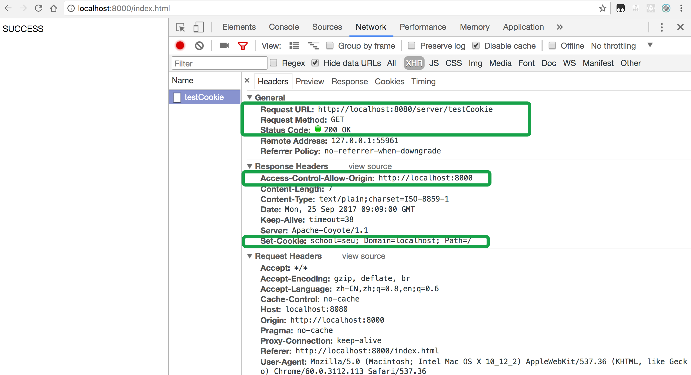

可以看到响应头中有Set-Cookie，再次请求时，如果是同源请求，浏览器会将Set-Cookie中的值放在请求头中，但是**对于跨域请求，默认是不发送这个Cookie的。**


如果要让浏览器发送cookie，需要在Client设置XMLHttpRequest的withCredentials属性为true。

Client:

```javascript
var containerElem = document.getElementById('container')
	new Request().send('http://localhost:8080/server/testCookie',{
		withCredentials: true,
		success: function(data){
			containerElem.innerHTML = data
		}
	});
```
现在浏览器在请求头中加入了cookie信息
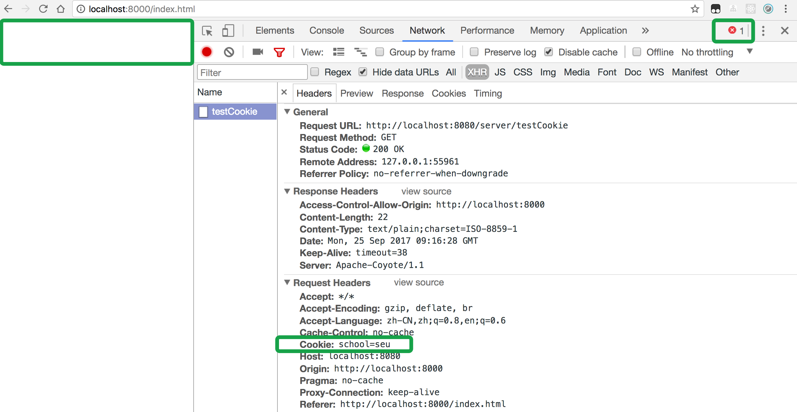
但是服务端返回的数据没有在页面中展示，并且报错：

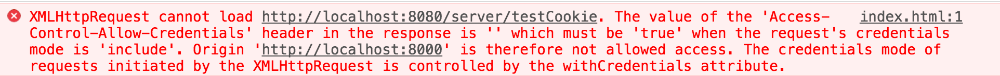

报错信息很明白： **当请求中包含凭证信息时，需要设置响应头Access-Control-Allow-Credentials，是否带凭证信息是由XMLHttpRequest的withCredentials属性控制的。**

所以我们在Server端filter中加入这个响应头：

```java
public void doFilter(ServletRequest servletRequest, ServletResponse servletResponse, FilterChain filterChain) throws IOException, ServletException {
        HttpServletResponse resp = (HttpServletResponse)servletResponse;
        resp.setHeader("Access-Control-Allow-Origin", "http://localhost:8000");
        resp.setHeader("Access-Control-Allow-Credentials","true");
        HttpServletRequest req = (HttpServletRequest) servletRequest;
        if (req.getMethod().equals("OPTIONS")) {
            resp.setStatus(200);
            resp.flushBuffer();
        }else {
            filterChain.doFilter(servletRequest,servletResponse);
        }
    }
```

现在浏览器知道响应头中Access-Control-Allow-Credentials为true，就会把数据给吐出来了，我们能够从response中拿到内容了。

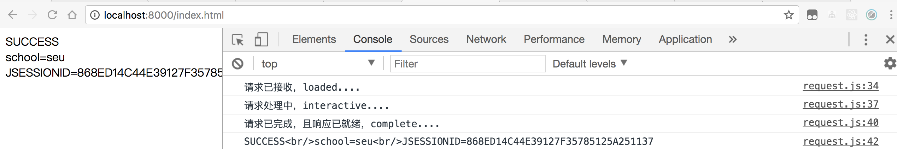

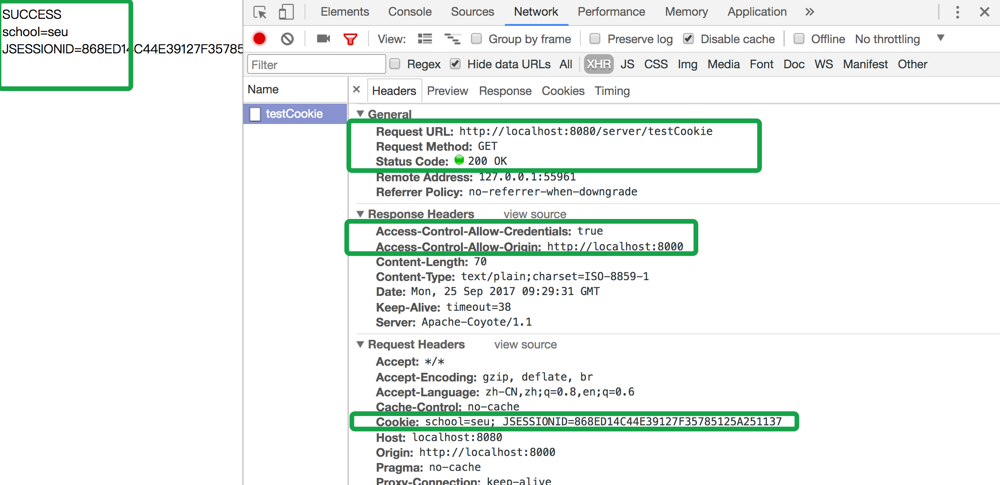

那如果附带凭证信息并且有预检请求呢？如果有预检请求，并附带凭证信息（XMLHttpRequest的withCredentials设置为true）， 服务端需要设置Access-Control-Allow-Credentials: true，否则浏览器不会发出第二次请求，并报错。

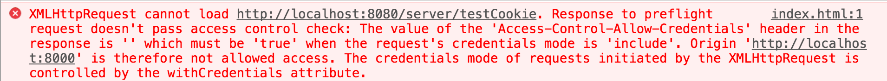


**总结：**


>1. 跨域请求时，浏览器默认不会发送cookie，需要设置XMLHttpRequest的withCredentials属性为true
2. 浏览器设置XMLHttpRequest的withCredentials属性为true，表明要向服务端发送凭证信息(这里是cookie)。那么服务端就需要在响应头中添加Access-Control-Allow-Credentials为true。否则浏览器上有两种情况：
   - 如果是简单请求，服务端结果吐出了，浏览器拿到了但就是不给吐出来，并报错。
   - 如果是预检请求，同样我们拿不到返回结果，并报错提示预检请求不通过，不会再发第二次请求。


## 其他

### cookie的同源策略

另外就是设置了XMLHttpRequest的withCredentials属性为true，浏览器发出去了，服务端还是拿不到cookie的问题。

cookie也遵循同源策略的，在设置cookie的时候可以发现除了键值对，还可以设置cookie的这些值： 

| cookie属性值 |说明|
|:--|:--|
| path |可访问cookie的路径，默认为当前文档位置的路径|
| domain |可访问cookie的域名，默认为当前文档位置的路径的域名部分|
| max-age|多久后失效，秒为单位时间。<br/>负数：session内有效；0：删除cookie；正数：有效期为创建时刻+ max-age|
| expires |cookie失效日期.如果没有定义,cookie会在对话结束时过期,即会话cookie|
| secure|cookie只通过https协议传输|

如果获取不到cookie，可以检查下cookie的domain.

### IE上跨域访问没有权限

在跨域发送ajax请求时提示没有权限。 因为IE浏览器默认对跨域访问有限制。需要在浏览器设置中去除限制。 

**方法：** 设置 > Internet选项 > 安全 > 自定义级别 > 在设置中找到其他 - 在【其他】中将【通过域访问数据源】启用

## 参考

- [Web安全 - 浏览器的同源策略](https://developer.mozilla.org/zh-CN/docs/Web/Security/Same-origin_policy)
- [HTTP-访问控制（CORS）](https://developer.mozilla.org/zh-CN/docs/Web/HTTP/Access_control_CORS)
- [Document - Document.cookie](https://developer.mozilla.org/zh-CN/docs/Web/API/Document/cookie)
- [聊一聊 cookie](https://segmentfault.com/a/1190000004556040)


   
  